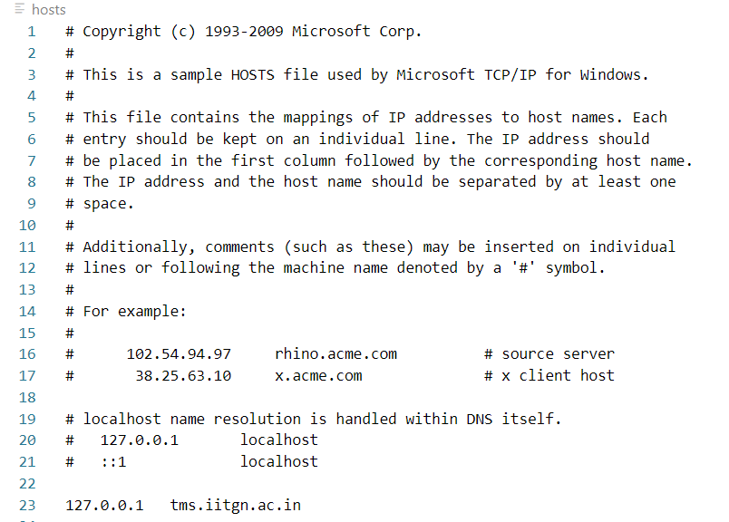

# TRANSPRT MANAGEMENT SYSTEM

## Tools and Skills Used
[](https://skillicons.dev)  

## Design


## Running the project
Currently, this project is supported in Windows devices only.  

## Setting up the Server
First, change the working directory to `transport-management-system` after cloning this repository.  
``` git clone https://github.com/ayushmodi12/transport-management-system.git```

### Installing all the dependencies
Please run the following command with the cloned repository as the current working directory to install all the required modules and packages.
```
pip install -r requirements.txt
```

### Create Database & Launch Web Server
Please run the `setup.py` to instantiate the database and launch the web server.  
Make sure that you don't have the database before running `setup.py`. Else directly launch the web server by executing `tms.py`. 

## Setting up the Client
### Add DNS Entry
1) Go to the hosts file. It can be typically found here `C:\Windows\System32\drivers\etc\hosts`.  
2) Add the following translation `127.0.0.1   tms.iitgn.ac.in` if the client and server are hosted on the same machine. Else add the public of the server machine. After that, your hosts file should look like this.  
  

Now `tms.iitgn.ac.in` is mapped to `127.0.0.1`, i.e. the local host and now we can access it like an actual website. So if we type `http://tms.iitgn.ac.in:5000/` on our browser, we will be able to access the webpage!  
We can also create our own personal local network, and set up the server in one computer, and access the webpage from another computer. This can be shown as a demo to the TA when requested.  

### Access the Webpage
Access the website by typing `http://tms.iitgn.ac.in:5000/` on the browser.  

## Screenshots of successful execution of the dynamic operations
### INSERT Operation:
### DELETE Operation:
### UPDATE Operation:
### RENAME Operation
### Use of WHERE Clause:

## Contributors
1) Mithil Pechimuthu
2) Ayush Modi
3) Shreesh Agarwal
4) Anushk Bhana
5) Vedant Kumbhar
